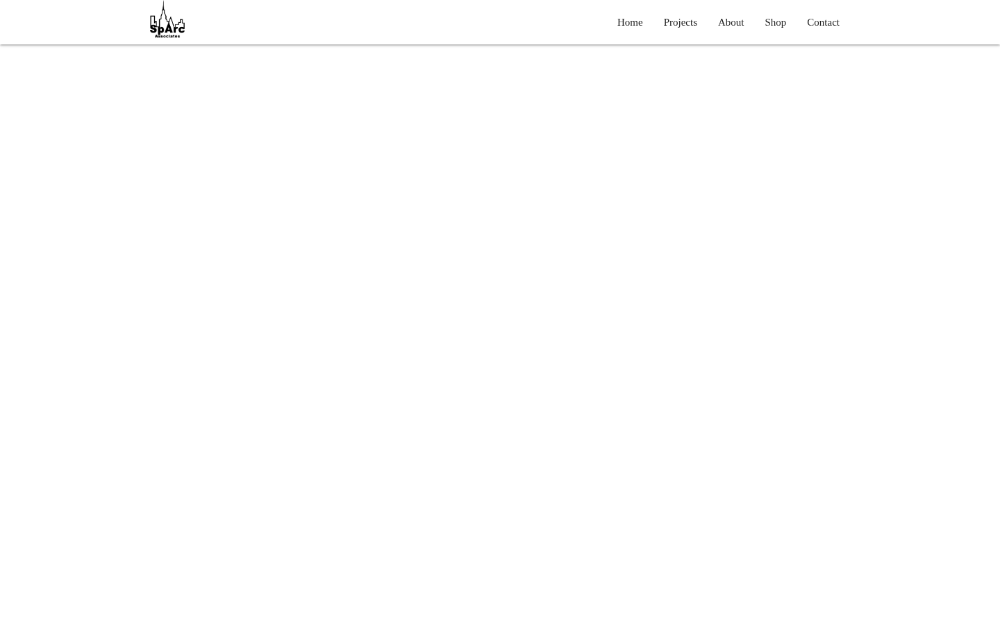
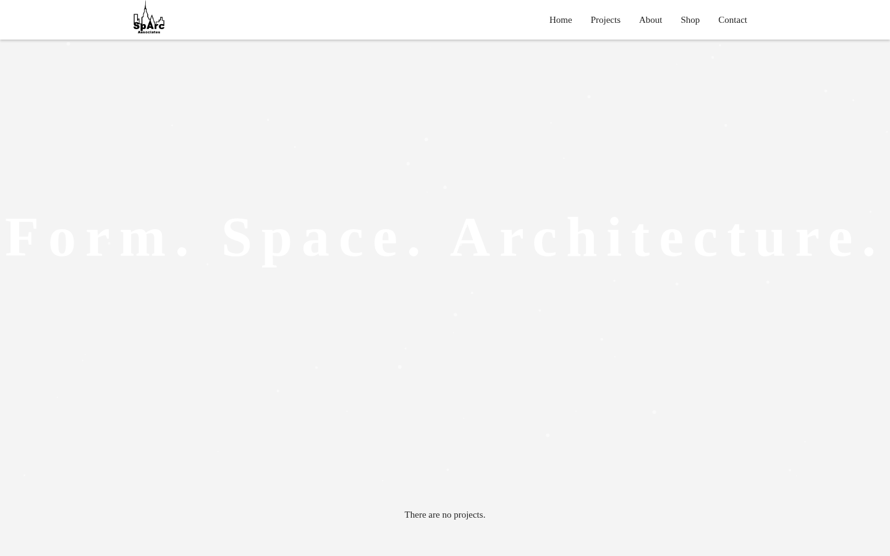
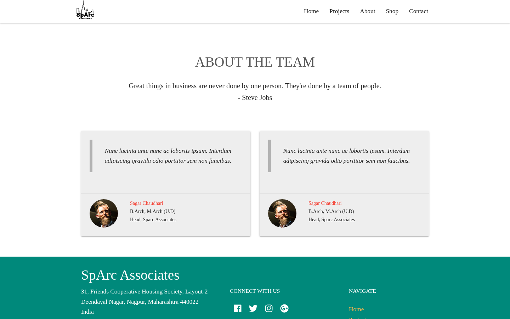
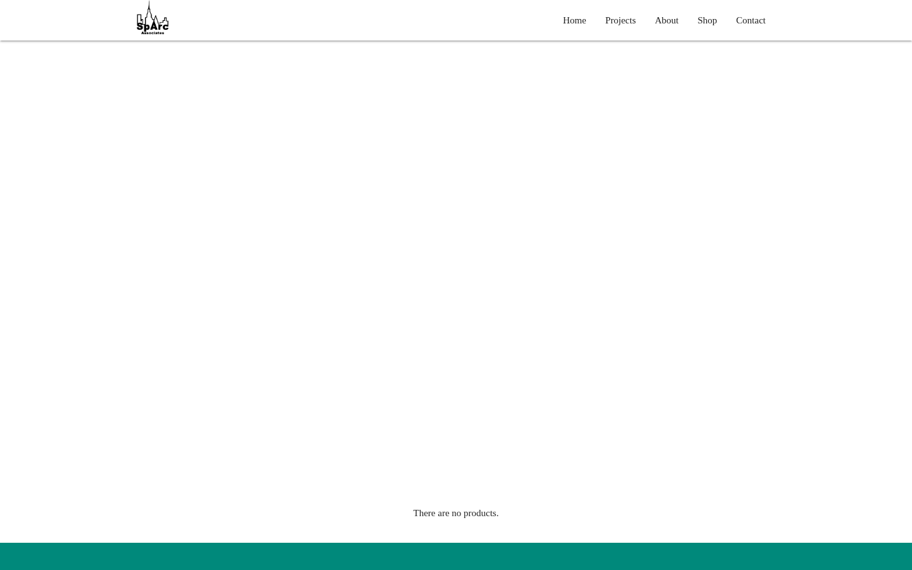
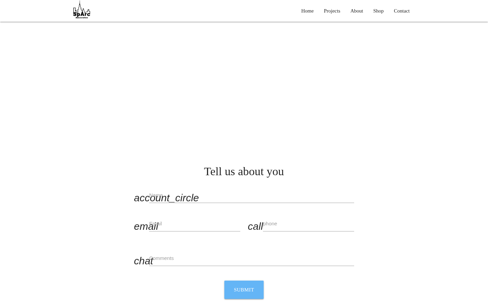
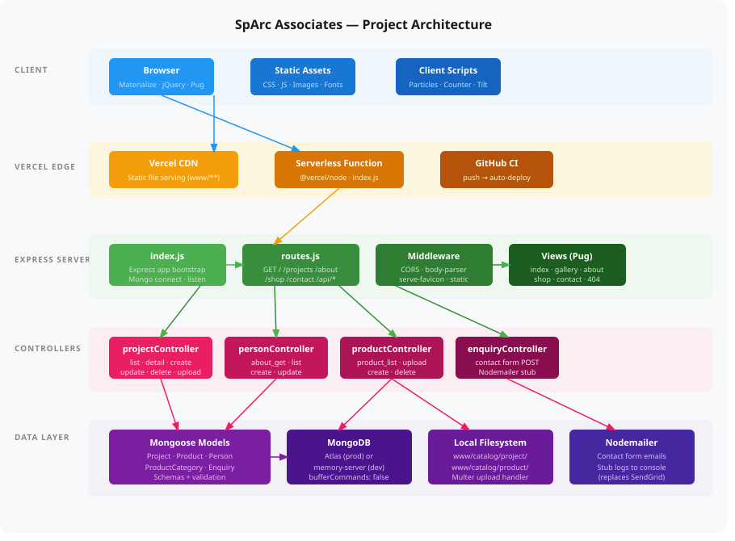

# SpArc Associates — Website

A full-stack portfolio and shop website for **SpArc Associates**, an architecture firm based in Nagpur, India. Built with Express, MongoDB, and Pug templates.

Original repo: <https://github.com/dayshmookh/website-sparc>

---

## Screenshots

### Home


### Projects


### About the Team


### Shop — Room of Art


### Contact


---

## Quick Start

```bash
npm install
npm start   # http://localhost:3000
```

No MongoDB? No problem — a local fallback starts automatically if `MONGODB_URI` is unset (requires network access to download `mongodb-memory-server`). You can also point the app at any running Mongo instance:

```bash
MONGODB_URI=mongodb://127.0.0.1:27017/sparc npm start
```

Optionally seed the database:

```bash
node scripts/populatedb.js mongodb://127.0.0.1:27017/sparc
```

Copy `.env.example` → `.env` to customise port, Mongo URI, and mailer settings.

---

## Tech Stack

- **Backend:** Node.js + Express
- **Database:** MongoDB + Mongoose
- **Templates:** Pug
- **File uploads:** Local filesystem (replaces original AWS S3 flow)
- **Email:** Nodemailer with a local stub (replaces original SendGrid flow)

## Pages

| Route | Description |
|---|---|
| `/` | Hero landing page with project gallery |
| `/projects` | Full project portfolio |
| `/about` | Team profiles |
| `/shop` | Room of Art — architectural prints shop |
| `/contact` | Contact form |

## What Changed vs. Upstream

1. **Startup hardened** — `dotenv` loaded; `mongodb-memory-server` fallback; server boots in degraded mode if Mongo is unreachable.
2. **Email** — SendGrid replaced with a local Nodemailer stub (logs to console, no API key needed).
3. **Image uploads** — AWS S3 replaced with a local filesystem flow; images served from `www/catalog/`.
4. **Graceful degraded mode** — all DB-backed routes render with empty data instead of hanging when MongoDB is unavailable.


The architecture flows top-to-bottom across five layers:
Client — The browser loads Pug-rendered HTML and pulls static assets (CSS, JS, images, fonts) alongside client-side scripts like Particles.js, the counter, and Tilt.js.
Vercel Edge — Incoming requests hit either the CDN (for static files in www/**) or the Serverless Function running index.js via @vercel/node. Every git push to GitHub triggers an automatic redeploy.
Express Server — index.js bootstraps the app (Mongo connection, middleware), routes.js maps all URL patterns, middleware handles CORS/body-parsing/favicon/static serving, and Pug templates render the HTML responses.
Controllers — Four controller files handle business logic: Projects (with image upload via Multer), Persons (About page), Products (Shop), and Enquiries (contact form → Nodemailer stub).
Data Layer — Mongoose models talk to MongoDB (Atlas in production, in-memory server in dev). File uploads land in www/catalog/. The Nodemailer stub replaced the original SendGrid integration and logs emails to the console.
